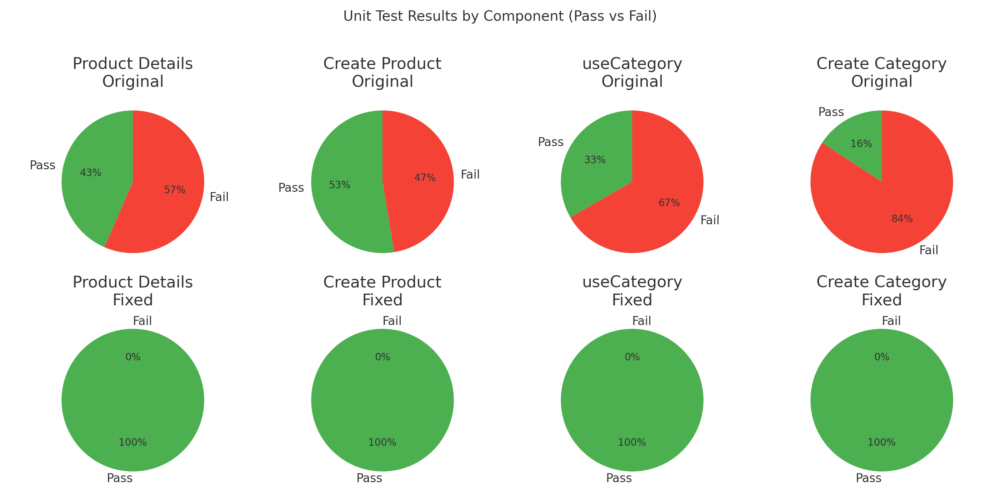

# Unit Test Report (Ma Yuan)

## Common Approach
- **Spec-driven, black-box** tests focusing on observable outcomes.  
- **Deterministic mocks**: `axios`, `react-hot-toast`, `react-router`, AntD shims, and DB models.  
- **Guardrails**: negative paths (`success:false`, rejects, missing params).  
- **Goal**: catch defects in user/API contracts while remaining resilient to refactoring.

## 1) Product Details (FE & BE)

**Scope**  
- FE: fetch by slug, render product info, related list, empty states, navigation, resilience to missing fields/failed APIs.  
- BE: controllers for `getSingleProduct`, `relatedProduct`, `productPhoto` with 400/404/500 handling.  

**Bugs → Fixes**  
- FE: unsafe field access, stale async updates, missing checks on ids.  
- BE: missing validations, inconsistent error envelopes, missing photo headers.  

**Stats**  
- FE: 12 tests → Original **10/2** → Fixed **12/0**  
- BE: 11 tests → Original **0/11** → Fixed **11/0**

## 2) Create Product (FE & BE*)

\*BE reuses category controller.

**Scope**  
- FE: category fetch, select UX, FormData integrity (incl. shipping/photo), submission outcomes.  
- BE*: missing name, duplicates, happy path, DB errors.  

**Bugs → Fixes**  
- FE: missing `await`, inverted success logic, shipping/photo not handled properly, typoed toasts.  
- BE*: broken `errro` reference in error path.  

**Stats**  
- FE: 12 tests → Original **5/7** → Fixed **12/0**  
- BE*: 7 tests → Original **5/2** → Fixed **7/0**

## 3) useCategory Hook

**Scope**  
- GET on mount, update state, reject handling, contract adherence, unmount safety.  

**Bugs → Fixes**  
- No `success` check → added.  
- No shape validation → array guard.  
- No unmount guard → added flag.  

**Stats**  
- 6 tests → Original **2/4** → Fixed **6/0**

## 4) Create Category (FE & BE)

**Scope**  
- FE: list load, create/update/delete flows, modal behavior, toast correctness.  
- BE: validations, duplicate checks, error handling.  

**Bugs → Fixes**  
- FE: AntD `visible→open`, typoed toasts, missing `success:false` handling.  
- BE: wrong codes/messages, missing validation, typoed `errro`.  

**Stats**  
- FE: 12 tests → Original **3/9** → Fixed **12/0**  
- BE: 7 tests → Original **0/7** → Fixed **7/0**

## Graphical Summary
**Combined results across all 4 components:**  

## Integration Test Plan (Across Features)
- **End-to-end flows** with MSW: product fetch, create, update, delete.  
- **Negative paths**: 400/404/500 errors surfaced with correct messages.  
- **Edge cases**: empty fields, no photo/category, rapid unmount/remount.  
- **Resilience & Accessibility**: slow networks, keyboard navigation, no console warnings.
